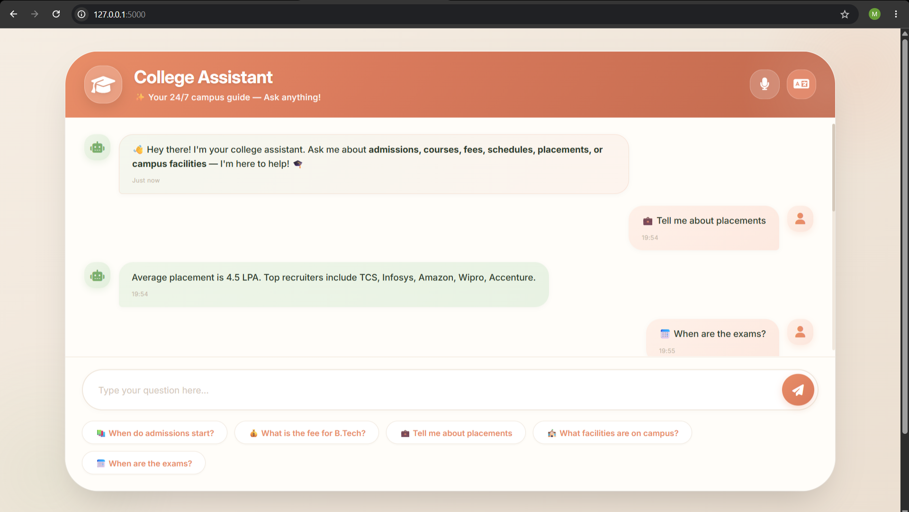

# 🎓 College Assistant AI Chatbot

An intelligent, voice-enabled FAQ chatbot for college inquiries, powered by **Natural Language Processing (NLP)** and designed with a modern, responsive user interface.



## ✨ Features

* 🤖 Smart NLP-based question understanding
* 🎤 Voice input support using Web Speech API
* 🌐 English and Hindi language support (Beta)
* 📱 Fully responsive design for mobile, tablet, and desktop
* ⚡ Real-time chatbot responses
* 🎨 Modern warm-themed UI
* 💬 Quick suggestion chips for common questions

## 🛠️ Tech Stack

| Category          | Technologies            |
| ----------------- | ----------------------- |
| Backend           | Python, Flask           |
| Machine Learning  | scikit-learn, NLTK      |
| Frontend          | HTML5, CSS3, JavaScript |
| Voice Recognition | Web Speech API          |
| Fonts             | Google Fonts (Inter)    |
| Icons             | Font Awesome 6          |

## 📋 Supported Query Categories

### Admissions

* When do admissions start?
* How can I apply?
* What are the eligibility criteria?

### Courses

* What courses are available?
* Is BCA offered?
* Do you provide engineering programs?

### Fees

* What is the B.Tech fee structure?
* What is the fee for BCA?
* Are scholarships available?

### Academic Information

* When are the exams?
* What is the academic calendar?
* When does the semester begin?

### Facilities

* Library timings
* Hostel facilities
* Sports and campus amenities

### Placements

* Placement statistics
* Average package offered
* Top recruiting companies

### Contact Information

* College phone number
* Email address
* Office timings

## 🚀 Installation & Setup

### Prerequisites

* Python 3.8+
* Git

### Clone the Repository

```bash
git clone https://github.com/mansaakohli15/college-chatbot.git
cd college-chatbot
```

### Install Dependencies

```bash
pip install -r requirements.txt
```

### Train the Chatbot Model

```bash
python train_chatbot.py
```

Expected output:

```text
✅ Model trained and saved as 'chatbot_model.pkl'
📊 Training data: 65 patterns, 9 categories
```

### Run the Application

```bash
python app.py
```

### Open in Browser

```text
http://127.0.0.1:5000
```

## 📁 Project Structure

```text
college-chatbot/
│
├── app.py
├── train_chatbot.py
├── intents.json
├── requirements.txt
├── chatbot_model.pkl
├── README.md
│
├── templates/
│   └── index.html
│
├── static/
│   ├── style.css
│   └── script.js
│
└── screenshot.png
```

## 🎨 Design Philosophy

The chatbot uses a warm and welcoming visual design rather than a traditional tech-focused appearance.

* Warm sand background for reduced eye strain
* Terracotta gradient header for a friendly feel
* Sage green chat bubbles for readability
* Soft shadows and smooth animations for a premium experience

## 🤝 Usage

1. Open the chatbot in your browser.
2. Type your question and press **Send**.
3. Click the **🎤 Microphone** button to ask questions using voice.
4. Use suggestion chips for quick access to frequently asked questions.
5. Switch languages using the **🌐 Language Toggle** (Beta).

## 🔮 Future Improvements

* Enhanced Hindi language support
* Integration with live college databases
* Student authentication and chat history
* Cloud deployment (Render, Railway, etc.)
* Additional FAQ categories
* Improved NLP accuracy with expanded training data

## 👨‍💻 Author

**Mansaa Kohli**
Internship Assignment Submission

## 📄 License

This project is licensed under the **MIT License**.

Feel free to use, modify, and distribute it for educational and personal purposes.
